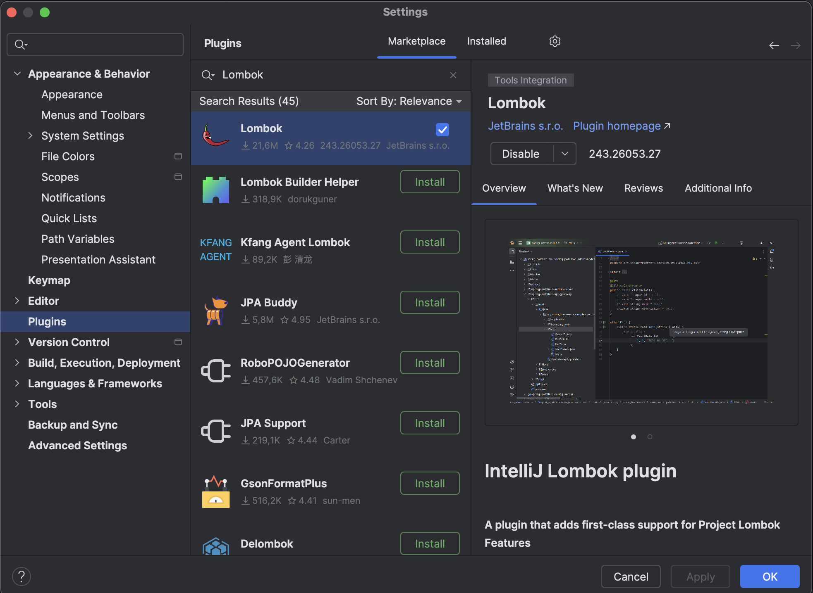

# Документация проекта: Wikimedia Kafka Pipeline

Проект состоит из двух модулей, взаимодействующих через Apache Kafka для обработки событий изменений в Wikimedia.  
**Язык:** Java 21, **Фреймворки:** Spring Boot, Spring Kafka, Spring Data JPA.

---

## Установка Apache Kafka

Скачайте и распакуйте папку с архивом `Apache Kafka` в каталоге `/opt`. Ссылка на скачивание https://kafka.apache.org/downloads

Далее перейдём в терминал и введём следующие команды:
1) Перейдём в папке `/opt`:
```bash
cd /opt
```

2) Создайте символьную ссылку под названием `/opt/kafka`, которая указывает на созданный каталог `/opt/kafka_2_11-2.1.0`:
```bash
ln -s /opt/kafka_2.11-2.1.0 /opt/kafka
```

3) Создаем непривилегированного пользователя, который будет запускать как `zookeeper`, так и сервис `kafka`.
```bash
useradd kafka
``` 

4) Установите нового пользователя в качестве владельца всего каталога, который мы извлекли, рекурсивно:
```bash
chown -R kafka:kafka /opt/kafka*
``` 

5) Создаем модульный файл /etc/systemd/system/zookeeper.service со следующим содержимым:
```bash
[Unit]
Description=zookeeper
After=syslog.target network.target

[Service]
Type=simple

User=kafka
Group=kafka

ExecStart=/opt/kafka/bin/zookeeper-server-start.sh /opt/kafka/config/zookeeper.properties
ExecStop=/opt/kafka/bin/zookeeper-server-stop.sh

[Install]
WantedBy=multi-user.target
```

Обратите внимание, что нам не нужно писать номер версии три раза из-за созданной нами символической ссылки. То же самое относится к следующему файлу  для Kafka, `/etc/systemd/system/kafka.service`, который содержит следующие строки конфигурации:
```bash
[Unit]
Description=Apache Kafka
Requires=zookeeper.service
After=zookeeper.service

[Service]
Type=simple

User=kafka
Group=kafka

ExecStart=/opt/kafka/bin/kafka-server-start.sh /opt/kafka/config/server.properties
ExecStop=/opt/kafka/bin/kafka-server-stop.sh

[Install]
WantedBy=multi-user.target
```

6) Нам нужно перезагрузить systemd, чтобы заставить его прочитать новые файлы unit:
```bash
systemctl daemon-reload
```

7) Теперь запустим `zookeeper` и `kafka`:
```bash
systemctl start zookeeper
```

```bash
systemctl start kafka
```

8) Дополнительно мы можем включить автоматический запуск при загрузке OS для обеих служб:
```bash
systemctl enable zookeeper.service
```

```bash
systemctl enable kafka.service
```


## Установка и конфигурация СУБД

1) Установить [СУБД Ред База Данных](https://reddatabase.ru/ru/downloads/rdb30/) (https://rutube.ru/video/5d2d76a962614cf5e5d0abae902b6537/?r=wd)
2) Установить [RedExpert](https://reddatabase.ru/ru/downloads/redexpert/) (https://rutube.ru/video/5d2d76a962614cf5e5d0abae902b6537/?r=wd)
3) Создать базу данных со следующими параметрами:


## Архитектура системы Wikimedia Kafka Pipeline


Структура проекта:
```bash
spring-kafka-wiki/
├── kafka-producer-wikimedia/ #Kafka Producer
├── kafka-consumer-database/ #Kafka Consumer
├── pom.xml
```

---

## Создаём проект

Переходим на [Spring.io](https://start.spring.io) (https://start.spring.io) и заполняем поля. Зависимости мы позже дополним.


Нажимаем на кнопку `GENERATE` и разархивируем созданный проект. Открываем приложение `IntelliJ Idea Community` и указываем путь к проекту. Открываем расширение и устанавливаем `Lombok`



Проект будет разбит на два модуля: 
- Модуль 1: Kafka Consumer
- Модуль 2: Kafka Producer 

Нам необходимо создать два модуля к проекту. Щёлкаем правой кнопкой и создаём модуль.


Называем первый модуль "`kafka-consumer-databas`", второй "`kafka-producer-wikimedia`".

В файле pom.xml должна быть такая структура:
```xml
<?xml version="1.0" encoding="UTF-8"?>
<project xmlns="http://maven.apache.org/POM/4.0.0" xmlns:xsi="http://www.w3.org/2001/XMLSchema-instance"
	xsi:schemaLocation="http://maven.apache.org/POM/4.0.0 https://maven.apache.org/xsd/maven-4.0.0.xsd">
	<modelVersion>4.0.0</modelVersion>
	<parent>
		<groupId>org.springframework.boot</groupId>
		<artifactId>spring-boot-starter-parent</artifactId>
		<version>3.4.4</version>
		<relativePath/>
	</parent>
	<groupId>com.student</groupId>
	<artifactId>spring-kafka-wiki</artifactId>
	<version>0.0.1-SNAPSHOT</version>
	<name>spring-kafka-wiki</name>
	<description>Demo project for Spring Boot and Kafka</description>
	<modules>
		<module>kafka-producer-wikimedia</module>
		<module>kafka-consumer-database</module>
	</modules>
	<packaging>pom</packaging>

	<url/>
	<licenses>
		<license/>
	</licenses>
	<developers>
		<developer/>
	</developers>
	<scm>
		<connection/>
		<developerConnection/>
		<tag/>
		<url/>
	</scm>
	<properties>
		<java.version>21</java.version>
	</properties>
	<dependencies>
		<dependency>
			<groupId>org.springframework.boot</groupId>
			<artifactId>spring-boot-starter</artifactId>
		</dependency>
		<dependency>
			<groupId>org.springframework.kafka</groupId>
			<artifactId>spring-kafka</artifactId>
		</dependency>

		<dependency>
			<groupId>org.projectlombok</groupId>
			<artifactId>lombok</artifactId>
			<optional>true</optional>
		</dependency>
		<dependency>
			<groupId>org.springframework.boot</groupId>
			<artifactId>spring-boot-starter-test</artifactId>
			<scope>test</scope>
		</dependency>
		<dependency>
			<groupId>org.springframework.kafka</groupId>
			<artifactId>spring-kafka-test</artifactId>
			<scope>test</scope>
		</dependency>
	</dependencies>

	<build>
		<plugins>
			<plugin>
				<groupId>org.apache.maven.plugins</groupId>
				<artifactId>maven-compiler-plugin</artifactId>
				<configuration>
					<annotationProcessorPaths>
						<path>
							<groupId>org.projectlombok</groupId>
							<artifactId>lombok</artifactId>
						</path>
					</annotationProcessorPaths>
				</configuration>
			</plugin>
			<plugin>
				<groupId>org.springframework.boot</groupId>
				<artifactId>spring-boot-maven-plugin</artifactId>
				<configuration>
					<excludes>
						<exclude>
							<groupId>org.projectlombok</groupId>
							<artifactId>lombok</artifactId>
						</exclude>
					</excludes>
				</configuration>
			</plugin>
		</plugins>
	</build>

</project>
```

После чего переходим к реализации модулей.


## Модуль 1: Kafka Consumer (Сохранение в Firebird)

### Цель
Получать события из топика Kafka `wikimedia_recent_change` и сохранять их в базу данных Firebird.

---

### Ключевые компоненты

#### 1.1. Сущность `WikiEvent`
  - **Структура записи**:
  ```sql
    CREATE TABLE WIKI_EVENT (
    ID BIGINT NOT NULL, 
    COMMENT VARCHAR(255), 
    EVENT_ID BIGINT, 
    EVENT_TYPE VARCHAR(255), 
    timestamp BIGINT, 
    PAGE_ID BIGINT, 
    USER_ID BIGINT, 
    PRIMARY KEY (ID), 
    CONSTRAINT FKP FOREIGN KEY (PAGE_ID) REFERENCES "WIKI_PAGE" ("ID") ON UPDATE NO ACTION ON DELETE NO ACTION,
    CONSTRAINT FKB FOREIGN KEY (USER_ID) REFERENCES "WIKI_USER" ("ID") ON UPDATE NO ACTION ON DELETE NO ACTION
    );
  ```
  - **Полный код**:
  ```java
  package com.student.springboot.entity;  
  
  import jakarta.persistence.*;
  import lombok.Getter;
  import lombok.Setter;
  
  @Entity
  @Table(name = "wiki_event")
  @Getter
  @Setter
  public class WikiEvent {
  
      @Id
      @GeneratedValue(strategy = GenerationType.IDENTITY)
      private Long id;
  
      private Long eventId;
      private String eventType;
      private String comment;
      private Long timestamp;
  
      @ManyToOne
      @JoinColumn(name = "page_id")
      private WikiPage page;
  
      @ManyToOne
      @JoinColumn(name = "user_id")
      private WikiUser user;
  }
  ```

#### 1.2. Сущность `WikiPage`
  - **Структура записи**:
  ```sql
    CREATE TABLE WIKI_PAGE (
    ID BIGINT NOT NULL, 
    SERVER_URL VARCHAR(255), 
    TITLE VARCHAR(255), 
    TITLE_URL VARCHAR(255), 
    PRIMARY KEY (ID)
    );
  ```
  - **Полный код**:
  ```java
  package com.student.springboot.entity;  
  
  import jakarta.persistence.*;
  import lombok.Getter;
  import lombok.Setter;
  
  @Entity
  @Table(name = "wiki_page")
  @Getter
  @Setter
  public class WikiPage {
  
      @Id
      @GeneratedValue(strategy = GenerationType.IDENTITY)
      private Long id;
  
      private String title;
      private String titleUrl;
      private String serverUrl;
  }
  ```

#### 1.3. Сущность `WikiUser`
  - **Структура записи**:
  ```sql
    CREATE TABLE WIKI_USER (
    ID BIGINT NOT NULL, 
    USERNAME VARCHAR(255), 
    PRIMARY KEY (ID)
    );
  ```
  - **Полный код**:
  ```java
  package com.student.springboot.entity;  
  
  import jakarta.persistence.*;
  import lombok.Getter;
  import lombok.Setter;
  
  @Entity
  @Table(name = "wiki_user")
  @Getter
  @Setter
  public class WikiUser {
  
      @Id
      @GeneratedValue(strategy = GenerationType.IDENTITY)
      private Long id;
  
      private String username;
  }
  ```

#### 2.1. Репозиторий `WikiEventRepository`
  - **Полный код**:
  ```java
  package com.student.springboot.repository;

  import com.student.springboot.entity.WikiEvent;
  import org.springframework.data.jpa.repository.JpaRepository;
  
  public interface WikiEventRepository extends JpaRepository<WikiEvent, Long> { }
  ```
  - Наследует CRUD-методы: `save()`, `findAll()`, `deleteById()`.

#### 2.2. Репозиторий `WikiPageRepository`
  - **Полный код**:
  ```java
  package com.student.springboot.repository;

  import com.student.springboot.entity.WikiPage;
  import org.springframework.data.jpa.repository.JpaRepository;
  
  public interface WikiPageRepository extends JpaRepository<WikiPage, Long> {
      WikiPage findByTitle(String title);
  }
  ```
  - Наследует CRUD-методы: `save()`, `findAll()`, `deleteById()`.
  - Создаём метод: `findByTitle(String title)`

#### 2.3. Репозиторий `WikimediaDataRepository`
  - **Полный код**:
  ```java
  package com.student.springboot.repository;

  import com.student.springboot.entity.WikiUser;
  import org.springframework.data.jpa.repository.JpaRepository;
  
  public interface WikiUserRepository extends JpaRepository<WikiUser, Long> {
      WikiUser findByUsername(String username);
  }
  ```
  - Наследует CRUD-методы: `save()`, `findAll()`, `deleteById()`.
  - Создаём метод: `findByUsername(String username)`

#### 3. Сервис `KafkaDatabaseConsumer`
  - **Логика работы**:
  ```java
  @KafkaListener(topics = "wikimedia_recent_change", groupId = "myGroup")
  @Transactional
  public void consume(String eventMessage) {
      try {
          LOGGER.info("Event message received -> {}", eventMessage);
          JsonNode rootNode = objectMapper.readTree(eventMessage);
          
          String pageTitle = rootNode.path("title").asText();
          String pageUrl = rootNode.path("title_url").asText();
          String username = rootNode.path("user").asText();
          String eventType = rootNode.path("type").asText();
          String comment = rootNode.path("comment").asText();
          Long eventId = rootNode.path("id").asLong();
          Long timestamp = rootNode.path("timestamp").asLong();
          String serverUrl = rootNode.path("server_url").asText();
          
          WikiPage page = pageRepository.findByTitle(pageTitle);
          if (page == null) {
              page = new WikiPage();
              page.setTitle(pageTitle);
              page.setTitleUrl(pageUrl);
              page.setServerUrl(serverUrl);
              pageRepository.save(page);
          }
          
          WikiUser user = userRepository.findByUsername(username);
          if (user == null) {
              user = new WikiUser();
              user.setUsername(username);
              userRepository.save(user);
          }
          
          WikiEvent wikiEvent = new WikiEvent();
          wikiEvent.setEventId(eventId);
          wikiEvent.setEventType(eventType);
          wikiEvent.setComment(comment);
          wikiEvent.setTimestamp(timestamp);
          wikiEvent.setPage(page);
          wikiEvent.setUser(user);
          
          eventRepository.save(wikiEvent);
      } catch (Exception e) {
          LOGGER.error("Error while processing event message", e);
      }
  }
  ```
  - `@KafkaListener`: Подписывается на топик с балансировкой нагрузки через `groupId`.
  - **Полный код**:
  ```java
  package com.student.springboot.kafka;
  
  import com.fasterxml.jackson.databind.JsonNode;
  import com.fasterxml.jackson.databind.ObjectMapper;
  import com.student.springboot.entity.WikiEvent;
  import com.student.springboot.entity.WikiPage;
  import com.student.springboot.entity.WikiUser;
  import com.student.springboot.repository.WikiEventRepository;
  import com.student.springboot.repository.WikiPageRepository;
  import com.student.springboot.repository.WikiUserRepository;
  
  import jakarta.transaction.Transactional;
  
  import org.slf4j.Logger;
  import org.slf4j.LoggerFactory;
  import org.springframework.kafka.annotation.KafkaListener;
  import org.springframework.stereotype.Service;
  
  @Service
  public class KafkaDatabaseConsumer {
  
      private static final Logger LOGGER = LoggerFactory.getLogger(KafkaDatabaseConsumer.class);
  
      private final WikiEventRepository eventRepository;
      private final WikiPageRepository pageRepository;
      private final WikiUserRepository userRepository;
      private final ObjectMapper objectMapper;
  
      public KafkaDatabaseConsumer(WikiEventRepository eventRepository, WikiPageRepository pageRepository, WikiUserRepository userRepository) {
          this.eventRepository = eventRepository;
          this.pageRepository = pageRepository;
          this.userRepository = userRepository;
          this.objectMapper = new ObjectMapper();
      }
  
      @KafkaListener(topics = "wikimedia_recent_change", groupId = "myGroup")
      @Transactional
      public void consume(String eventMessage) {
          try {
              LOGGER.info("Event message received -> {}", eventMessage);
  
              JsonNode rootNode = objectMapper.readTree(eventMessage);
              
              // Извлечение данных из JSON
              String pageTitle = rootNode.path("title").asText();
              String pageUrl = rootNode.path("title_url").asText();
              String username = rootNode.path("user").asText();
              String eventType = rootNode.path("type").asText();
              String comment = rootNode.path("comment").asText();
              Long eventId = rootNode.path("id").asLong();
              Long timestamp = rootNode.path("timestamp").asLong();
              String serverUrl = rootNode.path("server_url").asText();
  
              // Проверка, существует ли такая страница
              WikiPage page = pageRepository.findByTitle(pageTitle);
              if (page == null) {
                  page = new WikiPage();
                  page.setTitle(pageTitle);
                  page.setTitleUrl(pageUrl);
                  page.setServerUrl(serverUrl);
                  pageRepository.save(page);
              }
  
              // Проверка, существует ли такой пользователь
              WikiUser user = userRepository.findByUsername(username);
              if (user == null) {
                  user = new WikiUser();
                  user.setUsername(username);
                  userRepository.save(user);
              }
  
              // Создание нового события
              WikiEvent wikiEvent = new WikiEvent();
              wikiEvent.setEventId(eventId);
              wikiEvent.setEventType(eventType);
              wikiEvent.setComment(comment);
              wikiEvent.setTimestamp(timestamp);
              wikiEvent.setPage(page);
              wikiEvent.setUser(user);
  
              // Сохранение события в базу
              eventRepository.save(wikiEvent);
          } catch (Exception e) {
              LOGGER.error("Error while processing event message", e);
          }
      }
  }
  ```

#### 4. Основное приложение
  -  **Полный код**:
  ```java
  package com.student.springboot;  
    
  import org.springframework.boot.SpringApplication;  
  import org.springframework.boot.autoconfigure.SpringBootApplication;  
    
  @SpringBootApplication  
  public class SpringBootConsumerApplication {  
    
      public static void main(String[] args) {  
          SpringApplication.run(SpringBootConsumerApplication.class, args);  
      }  
  }
  ```

#### 5. Конфигурация
  - **`application.properties`**:
  ```properties
    # Firebird
  spring.datasource.url=jdbc:firebirdsql://localhost:3050/tmp/  WIKIMEDIA.FDB
  spring.jpa.hibernate.ddl-auto=update # Автоматическая миграция   схемы
  ```
  - **Полный код `application.properties`**:
  ```properties
  spring.application.name=kafka-consumer-database  
    
  spring.kafka.consumer.bootstrap-servers=localhost:9092 #Адреса Kafka-брокеров 
  spring.kafka.consumer.group-id=myGroup #Группа потребителей 
  spring.kafka.consumer.auto-offset-reset=earliest #Поведение   при первом запуске - earliest – читать с начала топика |   latest – только новые сообщения
  spring.kafka.consumer.key-deserializer=org.apache.kafka.common.  serialization.StringDeserializer  
  spring.kafka.consumer.value-deserializer=org.apache.kafka.  common.serialization.StringDeserializer  
    
  spring.datasource.url=jdbc:firebirdsql://localhost:3050/tmp/  WIKIMEDIA.FDB?encoding=UTF8 #Путь к БД Firebird 
  spring.datasource.username=login  
  spring.datasource.password=password  
  spring.datasource.driver-class-name=org.firebirdsql.jdbc.  FBDriver #Драйвер JDBC для Firebird
  spring.jpa.database-platform=org.hibernate.community.dialect.  FirebirdDialect #Указывает диалект SQL для Firebird  
  spring.jpa.hibernate.ddl-auto=update #Автоматическое   обновление схемы БД. - update – добавляет новые таблицы/  колонки, но не удаляет существующие
  
  #Логирование SQL-запросов (для отладки):
  spring.jpa.properties.hibernate.show_sql=true #show_sql –   выводит SQL в консоль
  spring.jpa.properties.hibernate.use_sql_comments=true   #format_sql – красивое форматирование  
  spring.jpa.properties.hibernate.format_sql=true   #use_sql_comments – добавляет комментарии с параметрами
  ```
  
#### 6. Библиотеки
  - **`pom.xml`**:
  ```xml
  <project xmlns="http://maven.apache.org/POM/4.0.0"   xmlns:xsi="http://www.w3.org/2001/XMLSchema-instance"  
           xsi:schemaLocation="http://maven.apache.org/POM/4.0.0   http://maven.apache.org/xsd/maven-4.0.0.xsd">  
      <modelVersion>4.0.0</modelVersion>  
      <parent>        <groupId>com.student</groupId>  
          <artifactId>spring-kafka-wiki</artifactId>  
          <version>0.0.1-SNAPSHOT</version>  
      </parent>    <packaging>jar</packaging>  
    
      <artifactId>kafka-consumer-database</artifactId>  
    
      <dependencies>        <dependency>            <groupId>org.  springframework.boot</groupId>  
              <artifactId>spring-boot-starter-data-jpa</  artifactId>  
          </dependency>  
          <dependency>            <groupId>org.firebirdsql.jdbc</  groupId>  
              <artifactId>jaybird</artifactId>  
              <version>6.0.0</version>
          </dependency>  
    
          <dependency>            <groupId>org.hibernate.orm</  groupId>  
              <artifactId>hibernate-community-dialects</  artifactId>  
              <version>6.6.11.Final</version>  
          </dependency>    </dependencies>  
      <properties>        <maven.compiler.source>21</maven.  compiler.source>  
          <maven.compiler.target>21</maven.compiler.target>  
      </properties>  
  </project>
  ```

#### Структура модуля kafka-consumer-database


---

## Модуль 2: Kafka Producer (Чтение данных из Wikimedia)

### Цель
Читать потоковые данные из Wikimedia через HTTP-стрим и отправлять их в Kafka.

---

### Ключевые компоненты

#### 1. Конфигурация топика `KafkaTopicConfig`
  - **Полный код**:
  ```java
  package com.student.springboot.springboot.config;  
    
  import org.apache.kafka.clients.admin.NewTopic;  
  import org.springframework.context.annotation.Bean;  
  import org.springframework.context.annotation.Configuration;  
  import org.springframework.kafka.config.TopicBuilder;  
    
  @Configuration  
  public class KafkaTopicConfig {  
    
      @Bean  
      public NewTopic topic() {  
          return TopicBuilder  
                  .name("wikimedia_recent_change")  
                  .build();  
      }  
  }
  ```

#### 2. Обработчик событий `WikimediaChangesHandler`
  - **Логика работы**:
  ```java
  @Override
  public void onMessage(String s, MessageEvent event) {
      kafkaTemplate.send(topic, event.getData());
  }
  ```
    - Использует Server-Sent Events (SSE) для чтения потока.

  - **Полный код**:
  ```java
  package com.student.springboot.springboot.kafka;  
    
  import com.launchdarkly.eventsource.MessageEvent;  
  import com.launchdarkly.eventsource.background.BackgroundEventHandler;  
  import org.slf4j.Logger;  
  import org.slf4j.LoggerFactory;  
  import org.springframework.kafka.core.KafkaTemplate;  
    
  public class WikimediaChangesHandler implements BackgroundEventHandler {  
    
      private static final Logger LOGGER = LoggerFactory.getLogger(WikimediaChangesHandler.class);  
      private KafkaTemplate<String, String> kafkaTemplate;  
      private String topic;  
    
      public WikimediaChangesHandler(KafkaTemplate<String, String> kafkaTemplate, String topic) {  
          this.kafkaTemplate = kafkaTemplate;  
          this.topic = topic;  
      }  
    
      @Override  
      public void onOpen() throws Exception {  
    
      }  
    
      @Override  
      public void onClosed() throws Exception {  
    
      }  
    
      @Override  
      public void onMessage(String s, MessageEvent messageEvent) throws Exception {  
          LOGGER.info("event data -> {}", messageEvent.getData());  
    
          kafkaTemplate.send(topic, messageEvent.getData());  
      }  
    
      @Override  
      public void onComment(String s) throws Exception {  
    
      }  
    
      @Override  
      public void onError(Throwable throwable) {  
    
      }  
  }
  ```

#### 3. Сервис `WikimediaChangesProducer`
  - **Алгоритм**:
    ```java
    public void sendMessage() throws InterruptedException {
        eventSource.start();
        TimeUnit.MINUTES.sleep(10); // Чтение данных 10 минут
    }
    ```
    - Подключается к `https://stream.wikimedia.org/v2/stream/recentchange`.
  - **Полный код**:
  ```java
  package com.student.springboot.springboot.kafka;  
    
  import com.launchdarkly.eventsource.EventSource;  
  import com.launchdarkly.eventsource.background.BackgroundEventHandler;  
  import com.launchdarkly.eventsource.background.BackgroundEventSource;  
  import org.springframework.kafka.core.KafkaTemplate;  
  import org.springframework.stereotype.Service;  
    
  import java.net.URI;  
  import java.util.concurrent.TimeUnit;  
    
  @Service  
  public class WikimediaChangesProducer {  
    
      private KafkaTemplate<String, String > kafkaTemplate;  
    
      public WikimediaChangesProducer(KafkaTemplate<String, String> kafkaTemplate) {  
          this.kafkaTemplate = kafkaTemplate;  
      }  
    
      public void sendMessage() throws InterruptedException {  
          String topic = "wikimedia_recent_change";  
          String url = "https://stream.wikimedia.org/v2/stream/recentchange";  
    
          BackgroundEventHandler eventHandler = new WikimediaChangesHandler(kafkaTemplate, topic);  
          EventSource.Builder eventSourceBuilder = new EventSource.Builder(URI.create(url));  
          BackgroundEventSource eventSource = new BackgroundEventSource.Builder(eventHandler, eventSourceBuilder).build();  
    
          eventSource.start();  
          TimeUnit.MINUTES.sleep(10);  
          eventSource.close();  
      }  
  }
  ```

#### 4. Основное приложение
  - **Полный код**:
  ```java
  package com.student.springboot.springboot;  
    
  import com.student.springboot.springboot.kafka.WikimediaChangesProducer;  
  import org.springframework.beans.factory.annotation.Autowired;  
  import org.springframework.boot.CommandLineRunner;  
  import org.springframework.boot.SpringApplication;  
  import org.springframework.boot.autoconfigure.SpringBootApplication;  
    
  @SpringBootApplication  
  public class SpringBootProducerApplication implements CommandLineRunner {  
    
      public static void main(String[] args) {  
          SpringApplication.run(SpringBootProducerApplication.class, args);  
      }  
    
      @Autowired  
      private WikimediaChangesProducer wikimediaChangesProducer;  
    
      @Override  
      public void run(String... args) throws Exception {  
          wikimediaChangesProducer.sendMessage();  
      }  
  }
  ```

#### 5. Конфигурация
  - **Полный код `application.properties`**:
  ```properties
  spring.application.name=kafka-producer-wikimedia  
    
  spring.kafka.producer.bootstrap-servers=localhost:9092 #Адреса Kafka-брокеров  
  spring.kafka.producer.key-serializer=org.apache.kafka.common.serialization.StringSerializer  
  spring.kafka.producer.value-serializer=org.apache.kafka.common.serialization.StringSerializer
  ```

#### 6. Библиотеки
  - **`pom.xml`**:
  ```xml
  <project xmlns="http://maven.apache.org/POM/4.0.0" xmlns:xsi="http://www.w3.org/2001/XMLSchema-instance"  
           xsi:schemaLocation="http://maven.apache.org/POM/4.0.0 http://maven.apache.org/xsd/maven-4.0.0.xsd">  
      <modelVersion>4.0.0</modelVersion>  
      <parent>        <groupId>com.student</groupId>  
          <artifactId>spring-kafka-wiki</artifactId>  
          <version>0.0.1-SNAPSHOT</version>  
      </parent>    <packaging>jar</packaging>  
    
      <artifactId>kafka-producer-wikimedia</artifactId>  
    
      <dependencies>        <dependency>            <groupId>com.launchdarkly</groupId>  
              <artifactId>okhttp-eventsource</artifactId>  
              <version>4.1.1</version>  
          </dependency>  
          <dependency>            <groupId>com.fasterxml.jackson.core</groupId>  
              <artifactId>jackson-core</artifactId>  
              <version>2.18.3</version>  
          </dependency>  
          <dependency>            <groupId>com.fasterxml.jackson.core</groupId>  
              <artifactId>jackson-databind</artifactId>  
              <version>2.18.3</version>  
          </dependency>  
          <dependency>            <groupId>com.squareup.okhttp3</groupId>  
              <artifactId>okhttp</artifactId>  
              <version>4.12.0</version>  
          </dependency>    </dependencies>  
      <properties>        <maven.compiler.source>21</maven.compiler.source>  
          <maven.compiler.target>21</maven.compiler.target>  
      </properties>  
  </project>
  ```

#### Структура модуля kafka-producer-wikimedia


---

## Взаимодействие компонентов


---

## Запуск приложений
Необходимо запустить два модуля. Сначала один модуль, затем второй модуль. В какой последовательности не важно. 
### Для Consumer:
```bash  
mvn clean install  
```

```bash  
java -jar kafka-consumer-database/target/kafka-consumer-database-0.0.1-SNAPSHOT.jar  
```

### Для Producer:
```bash  
mvn clean install  
```

```bash  
java -jar kafka-producer-wikimedia/target/kafka-producer-wikimedia-0.0.1-SNAPSHOT.jar  
```

---

## Пример данных

### Входные данные (Wikimedia):
```json
{
  "$schema": "/mediawiki/recentchange/1.0.0",
  "meta": {
    "uri": "https://commons.wikimedia.org/wiki/Category:PD-Art_(PD-old-auto-expired)",
    "request_id": "86a251c3-5a7e-4bc2-8dff-213759dd8ab0",
    "id": "56277172-b1a5-43dd-9745-f1a4169626e0",
    "dt": "2025-03-22T23:43:59Z",
    "domain": "commons.wikimedia.org",
    "stream": "mediawiki.recentchange",
    "topic": "eqiad.mediawiki.recentchange",
    "partition": 0,
    "offset": 5452279844
  },
  "id": 2804539242,
  "type": "categorize",
  "namespace": 14,
  "title": "Category:PD-Art (PD-old-auto-expired)",
  "title_url": "https://commons.wikimedia.org/wiki/Category:PD-Art_(PD-old-auto-expired)",
  "comment": "[[:File:Can Llosellas.jpeg]] added to category",
  "timestamp": 1742687039,
  "user": "BMacZeroBot",
  "bot": true,
  "notify_url": "https://commons.wikimedia.org/w/index.php?diff=1012729098&oldid=847016153&rcid=2804539242",
  "server_url": "https://commons.wikimedia.org",
  "server_name": "commons.wikimedia.org",
  "server_script_path": "/w",
  "wiki": "commonswiki",
  "parsedcomment": "<a href=\"/wiki/File:Can_Llosellas.jpeg\" title=\"File:Can Llosellas.jpeg\">File:Can Llosellas.jpeg</a> added to category"
}
```
### Диаграмма Базы Данных


### Запись в Firebird:
| ID  | WikiUser                                                                                                                                                                                                                                                                                                         |
| --- | --------------------------------------------------------------------------------------------------------------------------------------------------------------------------------------------------------------------------------------------------------------------------------------------------------------------- |
| 1   | {"user":"白布飘扬"}                                                                                                                                                                                                                                                                                                  |

---

| ID  | WIKI_PAGE                                                                                                                                                                                                                                          |
| --- | ------------------------------------------------------------------------------------------------------------------------------------------------------------------------------------------------------------------------------------------------------ |
| 1   | {"server_url":"https://www.wikidata.org","title":"Lexeme:L656027","title_url":"https://www.wikidata.org/wiki/Lexeme:L656027"}                                                                                                                         |

---

| ID  | WIKI_EVENT                                                                                                                                                                                                                                                                                                                                                                                                                                 |
| --- | ---------------------------------------------------------------------------------------------------------------------------------------------------------------------------------------------------------------------------------------------------------------------------------------------------------------------------------------------------------------------------------------------------------------------------------------- |
| 1   | {"comment":"/* wbremoveclaims-remove:1| */ [[Property:P5402]]: [[Lexeme:L655642]]","event_id":2413917178,"event_type":"edit","timestamp":1745836301,"page_id":1,"user_id":1}                                                                                                                                                                                                                                                           |